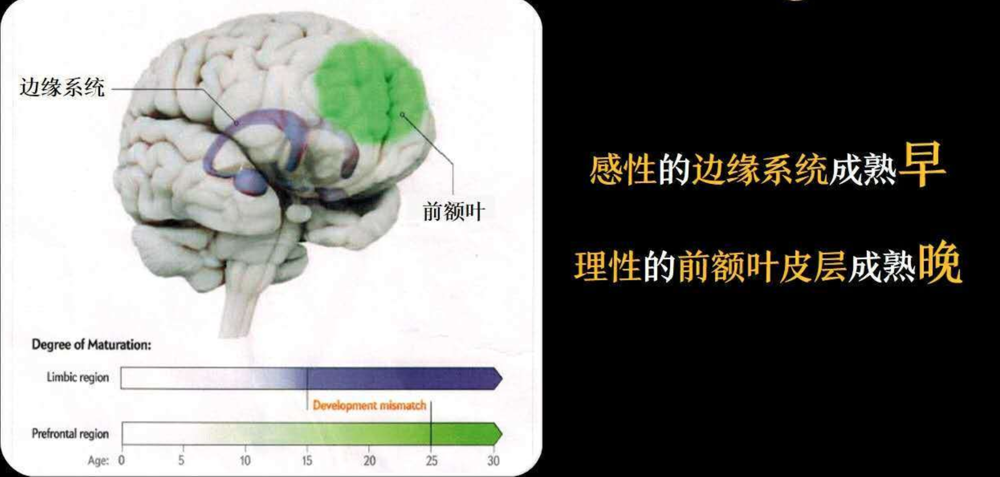
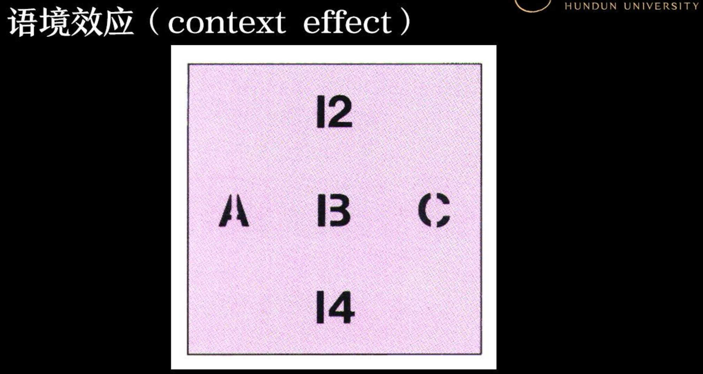

这里主要整理之前听混沌大学关于认知神经科学的课程，后边最好会根据自己的思考、认知重新整理。

## 快思满想

系统1的运行是**无意识且快速的**，不怎么非脑力，没有感觉，完全处于自主控制状态。
系统2是理性的、**有意识的**，以逻辑为基础，在意识中处理信息，它是缓慢的，工于计算。

> 和追寻记忆的痕迹书中描述的两种记忆有点类似。

大脑占身体体重的2%，缺消耗身体20%的能量，它无法一直去注意所有刺激，因此必须**将常用的行为习惯化**
来减少能源的支出。我们生活中60%是习惯化(无意识)的行为。

## 认知偏差的消除

#### 为什么偏差这么难消除？
大脑为节省资源，遇到问题会先由系统一处理，行不通才找系统二
- 系统一 过去的经验、捷径
- 系统二 知识、逻辑和计算

> 可以思考毛教员《改造我们的学习》，需要遵循辩证唯物论，而不是经验主义或者教条主义
> 关于双系统决策在ML中现在也是一个可期研究点

你的知识背景决定你看到的东西 。就像《世界观》说的那样：每个人的世界观都是由不同的观点板块构成的一个统一整体，所以有时候很难去说服一个人，因为你在尝试挑战他的世界观。

